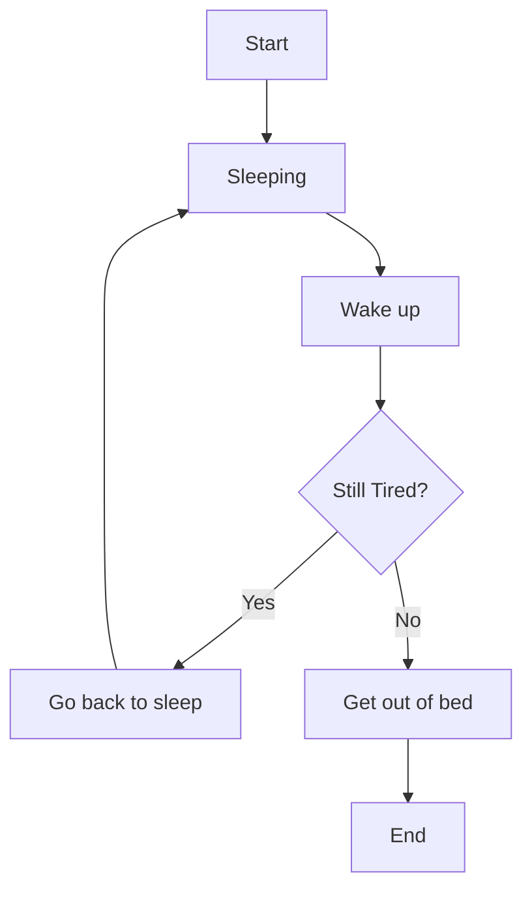

A - Start of the flowchart  
B - You are sleeping currently  
C - You wake up from sleeping  
D - Are you still tired? If yes then go to E, otherwise go to F  
E - Since you are still tired, go back to sleep in your bed. This takes you back to B  
F - Since you are no longer tired, get out of bed  
G - End of the flowchart  